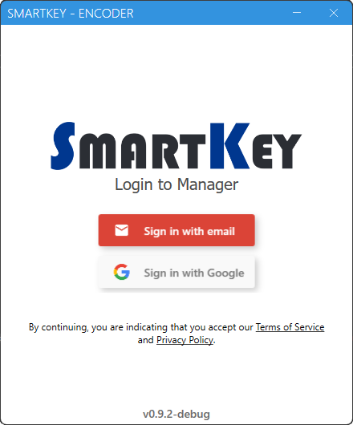

# SmartKey Encoder app
Application bridges communication between SmartKey Manager Web and USB-connected encoder on Windows PCs allowing to encode data to RFID cards.

  

  <a href="https://github.com/softlinsro/smartkey-manager-encoder-public/releases/latest/download/SmartkeyEncoder-win-Setup.exe" style="margin:auto; text-align:center; display:block;" >Download latest installer</a>

## Requirement
[Usb driver](https://www.silabs.com/developers/usb-to-uart-bridge-vcp-drivers?tab=downloads) - Silabs CP210x Windows drivers

[.NET 8.0](https://dotnet.microsoft.com/en-us/download/dotnet/8.0) - NET Desktop Runtime 8.0.x

[Microsoft Visual C++ 2015](https://aka.ms/vs/17/release/vc_redist.x64.exe) - Missing dependecy from used .dlls (vcruntime140)

> ⚠️ Every dependency will be installed in background or will prompt user with install wizard when installing via `setup.exe` 
